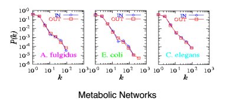
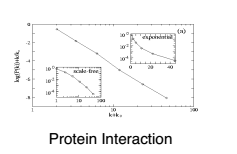

## Outline

* Background -- including definitions
 
* Major concepts
* History -- important models
* Applications

---

## What is Network Science?

* Study of networks--also known as graphs

* Originated from mathematical field of graph theory

* Applicable to social networks, AI, systems biology, neuroscience, web systems, etc.

--- &twocol

## Terminology

### Graph
In graph theory, a **graph** $G$ is a set of $V$ vertices and $E$ edges, written as $G=(V,E)$, where
* $|V| = n$    is the total number of vertices
* $|E| = m$    is total number of edges
 

### Degree
The **degree** $k_i$ of a vertex $v_i$ is the number of links connected to it.
***=left
Consider this graph:

***=right
So the degree of the ith vertex is:
$k_1 = 2\\ k_2=3 \\ k_3=2 \\ k_4=1$

--- &twocol 

## Terminology (cont.)
So what are networks?   Same idea, just different language.

*** =left
#### Graph theory
* Vertices
* Edges
* $G = (V,E)$ where $V$

*** =right
#### Network theory
* Nodes, where $N$ is total number of nodes (or vertices)
* Links, where $L$ is total number of links (or edges)
 

---

## History

 

#### Erdos-Renyi (ER) model
* 1960 - first to describe "random graph theory"

#### Watts-Strogatz model
* 1998 - extension of the ER model
    + also known as the "small-world model"

#### Scale-free model
* ~1999 to 2000's - surge of research about real-world networks

---&twocol

## Erdos-Renyi and random networks

* A network of $N$ nodes has a probability $p$ that a link exists between each pair of nodes.

* The probability $p_L$ that a network has exactly $L$ links follows a binomial distribution

* as $N \rightarrow \infty$, the probability approaches a Poisson distribution

*** =left

*** =right
Consider:
    p = 1/6, N = 12

Two examples:

L=10  (left)

L=8  (right)

---&vcenter

## Random networks
* The average degree of a graph only tells us so much. Instead we consider:

#### Degree Distribution

---

## Watts-Strogatz -- the small-world phenomenon

#### Extends ER model

* Describes random models as being connected and that the total distance between any two nodes is "short."

* This is also known as "six degrees of separation"

---

## Real-life networks aren't random

* Caveat...

---&vcenter

## Random vs Scale-free Networks

---

## What does "scale-free" mean?

---&twocol

## Scale-free networks are everywhere!

*** =left

*** =right

---&twocol

## Scale-free networks are everywhere!

*** =left

The WWW!

*** =right

---&twocol

## Scale-free networks are everywhere!

*** =left

The WWW!

*** =right

---&twocol

## Scale-free networks are everywhere!

*** =left

The WWW!

*** =right

---
## References

* Barabasi, A. Network Science.http://barabasi.com/networksciencebook

